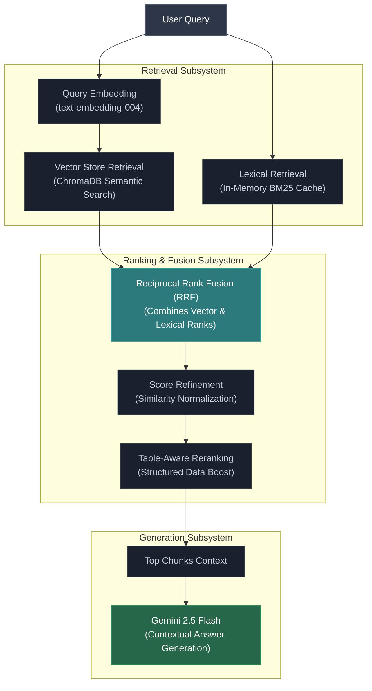

# SmartDoc AI Service (Python/Flask backend)

## Environment Variables

Copy `.env.example` to `.env` and configure:

- `PORT` — Port for the AI service (default: `5001`)
- `FRONTEND_ORIGINS` — Comma-separated CORS allowlist (e.g., `http://localhost:3000,https://your-frontend.vercel.app`)
- `NODE_BASE_URL` — Base URL of the Node.js API used for document download and metadata access
- `SERVICE_TOKEN` — Shared secret that must match the Node API's `SERVICE_TOKEN` for secure server-to-server communication (required)
- `GEMINI_API_KEY` — Google Generative AI API key
- `TEXT_MODEL` — Optional override for the Gemini text model (default: `models/gemini-2.5-flash`)
- `EMBED_MODEL` — Optional override for the embedding model (default: `models/text-embedding-004`)
- `INDEX_BATCH_SIZE` — Optional Chroma flush size during indexing (default: `64`)
- `JAILBREAK_THRESHOLD` — Optional weighted threshold for jailbreak detection (default: `3`)
- `BM25_CACHE_TTL` — Optional BM25 cache lifetime in seconds (recommended: 86400)

## Installation & Run

Create and activate a virtual environment, then install dependencies:

```bash
pip install -r requirements.txt
```

Start the AI service:

```bash
python main.py
```

The service runs on port `5001` by default.

## Health Check

- `GET /healthz` → `{ "status": "ok" }`

## Hybrid Retrieval

SmartDocQ uses a hybrid retrieval pipeline that combines:

- Semantic vector search using ChromaDB
- BM25 keyword retrieval
- Reciprocal Rank Fusion (RRF)
- Similarity-based score refinement
- Table-aware reranking

Retrieval workflow:



## Structured Data Support

SmartDocQ extracts and indexes structured data from:

- CSV
- XLSX
- DOCX tables

Table content is flattened into retrieval-friendly text and receives table-aware ranking boosts during question answering.

### Contextual Chunk Headers

Before embedding, SmartDocQ prepends contextual metadata such as:

- document title
- section information
- spreadsheet sheet names

This improves retrieval quality while preserving clean chunk text for user-facing responses and LLM context generation.

## Retrieval Quality Features

- Hybrid Retrieval (Vector + BM25)
- Reciprocal Rank Fusion (RRF)
- Table-Aware Retrieval
- Contextual Chunk Headers
- Automatic Index Version Validation

## Security Features

- Rejects common jailbreak and prompt-manipulation attempts in user questions before retrieval and LLM invocation
- Treats retrieved document context as untrusted data using guarded `<CONTEXT>` delimiters to reduce document-based prompt injection
- Detects sensitive data including PAN, Aadhaar, phone numbers, credit cards, emails, and SSN-like patterns
- Validates credit cards with the Luhn algorithm and Aadhaar numbers with the Verhoeff checksum algorithm to reduce false positives
- Applies India-focused phone number heuristics for improved detection accuracy
- Requires explicit user consent before processing documents containing sensitive information

## Index Lifecycle Management

SmartDocQ tracks version metadata for every embedded chunk stored in ChromaDB:

- `embedding_model` — embedding model used to generate the vector
- `pipeline_version` — indexing pipeline version (chunking, cleaning, preprocessing)
- `indexed_at` — UTC timestamp when the chunk was indexed
- `file_hash` — source document content hash used to detect document changes

Before retrieval, the system checks whether stored vectors are compatible with the current configuration.

### Automatic Reindexing Behavior

- **Embedding model changes** trigger automatic background reindexing and temporarily block retrieval because vectors generated by different models are mathematically incompatible.
- **Pipeline version changes** trigger background reindexing while continuing to serve the existing index.
- **Source document content changes** (file hash mismatch) trigger automatic reindexing.
- **Legacy chunks** without version metadata remain backward compatible and are upgraded automatically.

This prevents silent retrieval degradation when upgrading embedding models or modifying preprocessing logic.

## Testing

Note: `SERVICE_TOKEN` is required to import some modules; set it in your environment (a dummy value is fine for unit tests).

Run automated unit tests for the security module:

```bash
python -m pytest tests/test_security.py -v
```

Run the index lifecycle/versioning tests:

```bash
python -m pytest tests/test_vector_versioning.py -v
```

Run chunking unit tests:

```bash
python -m pytest tests/test_chunking.py -v
```

Run indexing pipeline/indexer unit tests:

```bash
python -m pytest tests/test_indexer.py -v
```

Run retrieval and table parsing tests:

```bash
python -m pytest tests/test_retrieval_and_tables_phase1.py -v
```

Run retrieval metadata caching tests:

```bash
python -m pytest tests/test_retrieval_meta_cache.py -v
```
